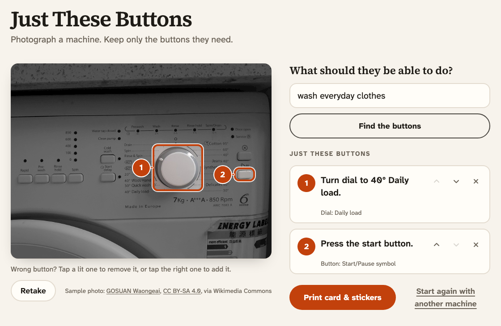
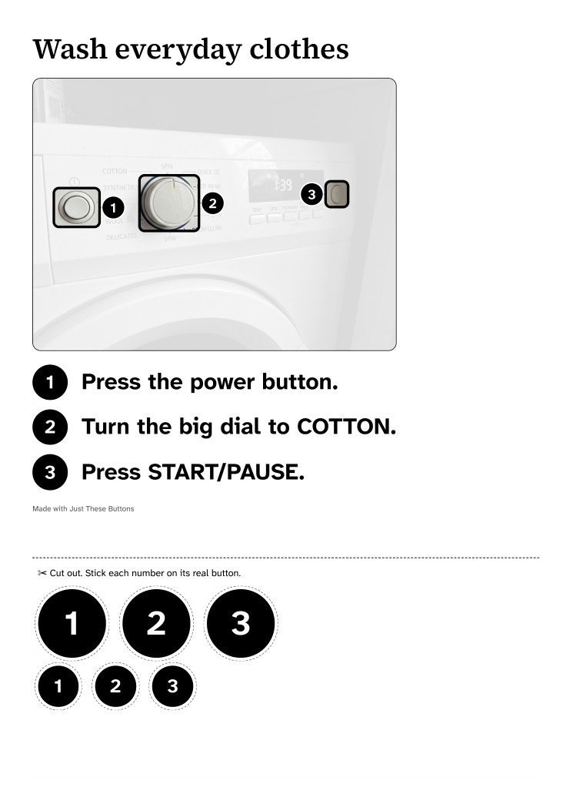
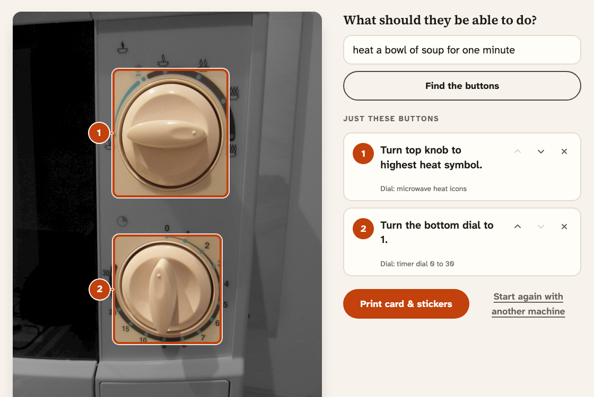

# Just These Buttons

**Photograph a machine your grandparent struggles with, name one task, and print a card that shows only the buttons that task needs.**

**Try it:** [just-these-buttons.vercel.app](https://just-these-buttons.vercel.app) (tap a sample photo, or use your phone's camera)



A web app for the grandchild or adult child who looks after an elderly grandparent. The grandparent's health or memory is failing, and they keep getting stuck on the washing machine or the TV remote. The family member opens a link, takes a photo, types what the grandparent needs to do ("wash everyday clothes"), and gets back:

- **The same photo with only the needed controls lit**, numbered in the order they are used, with one plain instruction each.
- **A chance to fix it.** Tap a lit button to remove it, tap another to add it, rewrite or reorder any step. Steps the AI is unsure of are marked *Check this one*.
- **One printed page**: a large-print step card to tape next to the machine, and number stickers to put on the real buttons.

The grandparent never touches a phone or an app. The help lives on the machine they already own.

| The printed page | Dials, not buttons |
|---|---|
|  |  |

*Sample photos: real appliances from Wikimedia Commons, CC BY-SA — see [photo credits](docs/photo-credits.md).*

## Why

Caregivers already do this by hand. On the Alzheimer's Society forum they describe taping paper over unused buttons, dabbing correction fluid on them, and drawing a red dot on START. People with memory problems often cannot learn a new "simpler" machine, so the one they have needs to become simple ([washing machines](https://forum.alzheimers.org.uk/threads/washing-machines%E2%80%A6.132410/), [a simple washing machine](https://forum.alzheimers.org.uk/threads/simple-to-use-washing-machine.21781/), [TV remote](https://forum.alzheimers.org.uk/threads/unable-to-use-television-remote.110176/)). Just These Buttons makes that fix from a photo in under a minute, for any machine.

## How it works

1. The browser turns the photo upright, shrinks it to 1600 px and sends it with the task to one server route.
2. The route asks **Gemini 3.8 Flash** for the controls the task needs, in order. Each control comes back as a box on a 0–1000 grid over the photo, with its printed label and an instruction. The reply is validated, and the route never logs the photo or the task.
3. The page draws the photo twice: dimmed underneath, and the original on top showing through a window at each box. Numbers are placed beside each button so they never hide a neighbouring key.
4. Every edit goes through small pure functions, so the photo and the list can't disagree. Printing uses the browser's print dialog with a one-page layout sized in millimetres for A4 and Letter.

There is no database and no login, and nothing is kept between visits. More in [docs/architecture.md](docs/architecture.md). How far the model's boxes can be trusted, and the one sentence in the prompt that mattered most, is in [docs/vision-probe.md](docs/vision-probe.md).

## Run it

You need Node.js 22 and a [Gemini API key](https://aistudio.google.com/apikey). Use a paid-tier key, so photos are not used to improve Google's products.

```bash
npm install
cp .env.example .env.local        # then set GEMINI_API_KEY
npm run dev                       # http://localhost:3000
```

Tap one of the sample photos (**Washing machine**, **Microwave**, **TV remote**), then **Find the buttons**. To use a phone's camera, open `http://<your-computer's-IP>:3000` on a phone on the same Wi-Fi.

| Command | What it does |
|---|---|
| `npm test` | Unit tests for step editing, number placement, reply validation and rate limiting |
| `npm run typecheck` | TypeScript |
| `npm run probe:photos` · `npm run probe` | Generate test photos, then check the model's boxes on them (see [vision probe](docs/vision-probe.md)) |

Optional settings are in `.env.example`: `GEMINI_MODEL`, `RATE_LIMIT` (per visitor per 10 minutes, default 20) and `DAILY_LIMIT` (default 300).

## Limits

- It is for people in the early stages of memory loss, and for anyone confused by a machine. Caregivers report that people at later stages can't use cards at all.
- The model can pick the wrong button, especially on small or cluttered remotes. That is why the family member checks every step before printing.
- Phones and touchscreens are out of scope. Their buttons are pictures that change with each update.
- The stickers come in two fixed sizes. Cover patches cut to each unused button's real size are future work.

## How it was built

It was built for Devpost's [Build With AI: Basics](https://learn-ai-basics.devpost.com/) with the Devpost Learn skill pack, planning before code:

- [devpost/scope.md](devpost/scope.md)
- [devpost/prd.md](devpost/prd.md)
- [devpost/spec.md](devpost/spec.md)
- [devpost/checklist.md](devpost/checklist.md), the build plan, including every place the build changed the plan

Each file has an HTML companion next to it. Code was written with Claude Code.

## Licence

Code: [MIT](LICENSE). Sample photos keep their own Creative Commons licences ([photo credits](docs/photo-credits.md)).
